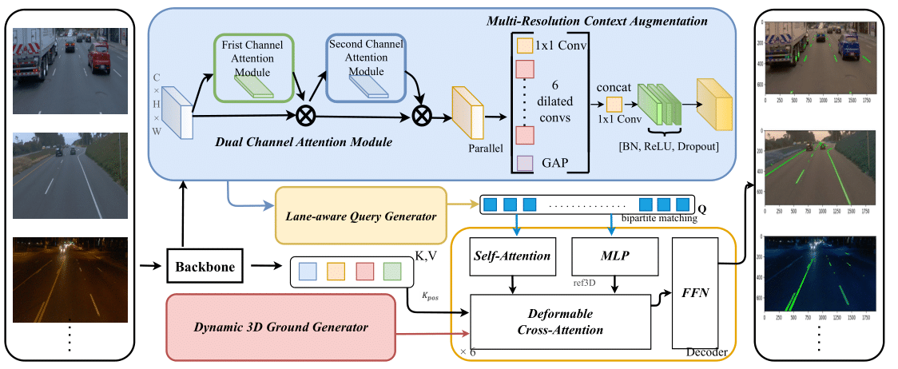

  <h3 align="center"><strong>Multi-Resolution Context Augmentation and Dual Channel Attention for 3D lane detection</strong></h3>


This is the official PyTorch implementation of [Multi-Resolution Context Augmentation and Dual Channel Attention for 3D lane detection](https://ieeexplore.ieee.org/document/11179998).

  

## News
  - **2025-09-25** :tada: MRDALane has been published in the *IEEE Internet of Things Journal*! :sparkles:


## Environments
To set up the required packages, please refer to the [installation guide](./docs/install.md).

## Data
Please follow [data preparation](./docs/data_preparation.md) to download dataset.


## Evaluation
Please refer to the [evaluation guide](https://./docs/train_eval.md#evaluation) for the testing procedure.

## Train And Evaluation
For training the model, please follow the steps outlined in our [training guide](https://./docs/train_eval.md#train).

## Benchmark

### OpenLane

| Models | F1 | Accuracy | X error <br> near \| far | Z-error <br> near \| far |
| ----- | -- | -------- | ------- | ------- |
| 3DLaneNet | 44.1 | - | 0.479 \| 0.572 | 0.367 \| 0.443 |
| GenLaneNet | 32.3 | - | 0.593 \| 0.494 | 0.140 \| 0.195 |
| Cond-IPM | 36.3 | - | 0.563 \| 1.080 | 0.421 \| 0.892 |
| PersFormer | 50.5 | 89.5 | 0.319 \| 0.325 | 0.112 \| 0.141 |
| CurveFormer | 50.5 | - | 0.340 \| 0.772 | 0.207 \| 0.651 |
| PersFormer-Res50 | 53.0 | 89.2 | 0.321 \| 0.303 | 0.085 \| 0.118 |
| LATR             | 61.9 | 92.0     | 0.219 \| 0.259           | 0.075 \| 0.104           |
| **MRDALane**     | 63.3 | 92.7     | 0.205 \| 0.245           | 0.074 \| 0.104           |


### Apollo

Plaes kindly refer to our paper for the performance on other scenes.

<table>
    <tr>
        <td>Scene</td>
        <td>Models</td>
        <td>F1</td>
        <td>AP</td>
        <td>X error <br> near | far </td>
        <td>Z error <br> near | far </td>
    </tr>
    <tr>
        <td rowspan="8">Visual Variations</td>
        <td>3DLaneNet</td>
        <td>74.9</td>
        <td>72.5</td>
        <td>0.115 | 0.601</td>
        <td>0.032 | 0.230</td>
    </tr>
    <tr>
        <td>Gen-LaneNet</td>
        <td>85.3</td>
        <td>87.2</td>
        <td>0.074 | 0.538</td>
        <td>0.015 | 0.232</td>
    </tr>
    <tr>
        <td>CLGo</td>
        <td>87.3</td>
        <td>89.2</td>
        <td>0.084 | 0.464</td>
        <td>0.045 | 0.312</td>
    </tr>
    <tr>
        <td>PersFormer</td>
        <td>89.6</td>
        <td>-</td>
        <td>0.074 | 0.430</td>
        <td>0.015 | 0.266</td>
    </tr>
    <tr>
        <td>GP</td>
        <td>89.9</td>
        <td>92.1</td>
        <td>0.060 | 0.446</td>
        <td>0.011 | 0.235</td>
    </tr>
    <tr>
        <td>CurveFormer</td>
        <td>90.8</td>
        <td>93.0</td>
        <td>0.125 | 0.410</td>
        <td>0.028 | 0.254</td>
    </tr>
    <tr>
        <td>LATR</td>
        <td>95.1</td>
        <td>96.6</td>
        <td>0.045 | 0.315</td>
        <td>0.016 | 0.228</td>
    </tr>
    <tr>
        <td><b>MRDALane</b></td>
      	<td>96.8</td>
        <td>97.1</td>
        <td>0.031 | 0.271</td>
        <td>0.012 | 0.219</td>
    </tr>
</table>

## Acknowledgment

This library is inspired by [OpenLane](https://github.com/OpenDriveLab/PersFormer_3DLane), [GenLaneNet](https://github.com/yuliangguo/Pytorch_Generalized_3D_Lane_Detection), [mmdetection3d](https://github.com/open-mmlab/mmdetection3d), [SparseInst](https://github.com/hustvl/SparseInst), [ONCE](https://github.com/once-3dlanes/once_3dlanes_benchmark) and many other related works, we thank them for sharing the code and datasets.


## Citation
If you find LATR is useful for your research, please consider citing the paper:

```tex
@article{ning2025multi,
  title={Multi-Resolution Context Augmentation and Dual Channel Attention for 3D lane detection},
  author={Ning, Qirui and Zhang, Jinlai and Xie, Yuhang and Liu, Kaifeng and Gao, Kai and Chen, Bin and Chen, Gengbiao and Fan, Qing and Liu, Hui and Du, Ronghua},
  journal={IEEE Internet of Things Journal},
  year={2025},
  publisher={IEEE}
}
```